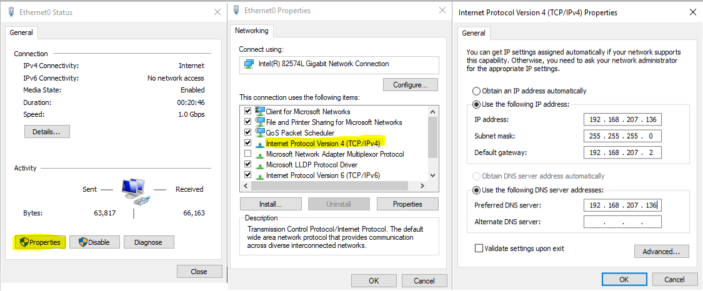
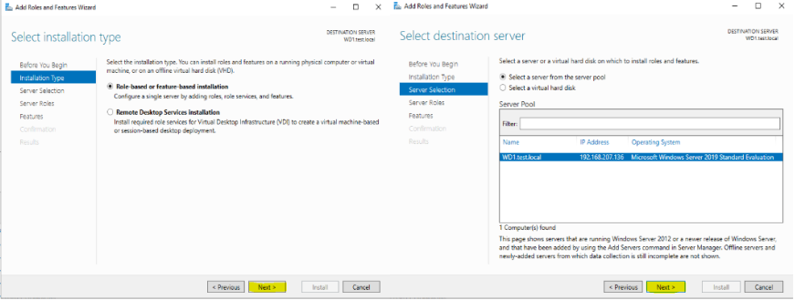
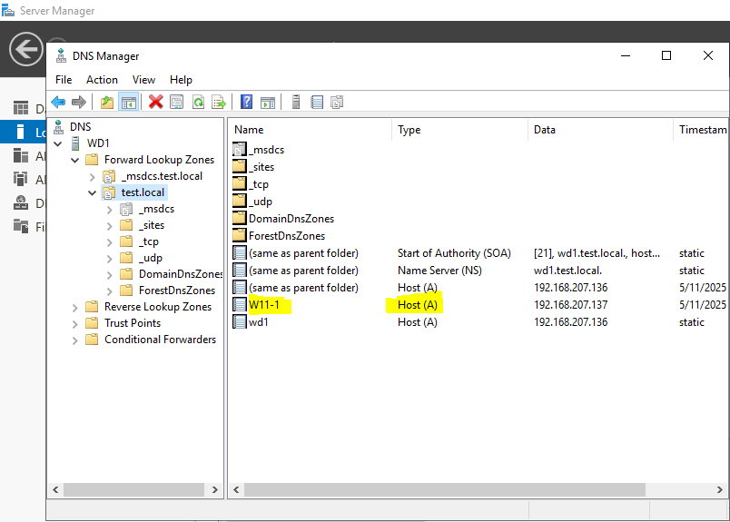

# WindowsServer-2019-AD-DNS-DomainSetup-Lab

Ten lab przedstawia proces konfiguracji nowej domeny Active Directory (AD) wraz z serwerem DNS na systemie Windows Server 2019. Dodatkowo, demonstruje dołączenie komputera z systemem Windows 11 do nowo utworzonej domeny. Wszystko się opiera 
na wirtualizacji z użyciem VMware Workstation Pro.

**Konfiguracja**

Początkowo za 1 czynność jaką się zabrałem to sprawdzenie IP naszego Windows Server 2019, skonfigurowanie IP statycznie 
w ramach labu oraz później przypisanie preferowanego serwera DNS, który by się odnosił do jego własnego IPv4, w tym przypadku.




Następnym krokiem jakiego się podjąłem jest zmiana nazwy serwera na bardziej przyjazną ***WD1*** oraz nadanie suffiksu DNS, który później będzie naszą nazwą domeny ***FQDN*** => końcowa, pełna i jednoznaczna nazwa urządzenia w sieci, która wskazuje jego dokładną lokalizację w hierarchicznej strukturze DNS. Składa się z nazwy hosta oraz sufiksu domenowego, tworząc pełny adres, docelowo ***WD1.test.local***


W rezultacie musimy ponownie uruchomić nasz windows server aby zaaplikować wprowadzone dotychczasowe zmiany.

Przechodząc dalej, dodajemy w opcjach zarządzania nową rolę/funkcjonalność => "Add Roles and Features" aby móc dodać nasz serwer DNS wraz z Active Directory w celu przypisania głównego kontrolera domeny w nowym lesie. Las ang. "Forest" to najwyższy poziom organizacji, który zawiera jeden lub więcej drzew domen. Każdy Las zawiera pojedynczą bazę danych Active Directory 
i pojedynczą globalną listę adresów, czyli nie można dzielić się nimi między Lasami. Jest to jak "ekosystem" dla wszystkich domen w strukturze, definiujący jej strukturę i zakres administracyjny. 




Wyszukujemy Serwer DNS:


Po instalacji DNS następnie przechodzę do instalacji Active Directory jednak już jako kolejny proces.


Od razu po instalacji Active Directory, promujemy nasz serwer do kontrolera domeny, gdzie utworzymy "las".


Jak widać na obrazie poniżej nasz serwer ma już zainstalowany DNS i jest Global Catalog (GC) co oznacza, że jest to indeks, który zawiera informacje o obiektach w katalogu, umożliwiając wyszukiwanie zasobów bez względu na ich położenie w domenie w odróżnieniu do ***DC***.


W dodatkowych opcjach podajemy ```NetBIOS``` domain name, jest to nazwa domeny podczas logowania do serwera, np. TEST\administrator + hasło. Windows server automatycznie podpowiada nam nazwę domeny dla NetBIOS opierając się na wcześniej wprowadzonej konfiguracji.


Przechodząc dalej z naszą konfiguracją ustalamy w jakim miejscu będziemy miec pliki bazodanowe active directory => "NTDS", folder z logami i "SYSVOL" - zbiór folderów na każdym kontrolerze domeny w domenie, które służą do replikacji ważnych plików i ustawień, takich jak obiekty zasad grupy (GPO) i skrypty logowania


Etapem końcowym tej konfiguracji jest otrzymanie potwierdzenia o przejściu wstępnych wymagań i rozpoczęcie instalacji.


Po instalacji musimy zrestartować serwer według instrukcji, które się ukażą po instalacji. Będziemy mogli zatem już zobaczyć efekt logowania z NetBIOS.


Można również zobaczyć już w 'Server Manager', że pole 'Domain' z "WORKGROUP" zmieniła się na ```test.local```.
Dodatkowo przechodząc do wcześniej zainstalowanego serwera DNS w sekcji "Tools" zobaczymy coś takiego jak DNS 'zones'-strefy.
Strefy DNS => zbiory nazw domenowych i odpowiadających im adresów IP, przechowywane na serwerach DNS.


Ostatnim etapem przedstawionym w tym labie jest przypisanie danego komputera do domeny ```test.local``` i weryfikacja na serwerze w strefie DNS adresów IP naszego hosta. 

Aby móc przypisać PC do domeny należy najpierw skonfigurować preferowany DNS w opcjach sieciowych tego komputera.


Także w opcjach systemowych po poprawnej adresacji ip serwera na naszym urządzeniu docelowym dokonujemy zmiany użytkownika jak to robiliśmy już wcześniej na serwerze z "WORKGROUP" na Domain: ```test.local```. System nas poprosi o upoważnienie administratora poprzez wpisanie NetBIOS username wraz z hasłem dla AD.


Pozostaje nam tylko zobaczyć czy faktycznie host został prawidłowo przypisany do naszej domeny i zarządzać nim w pozostałych laboratoriach.




